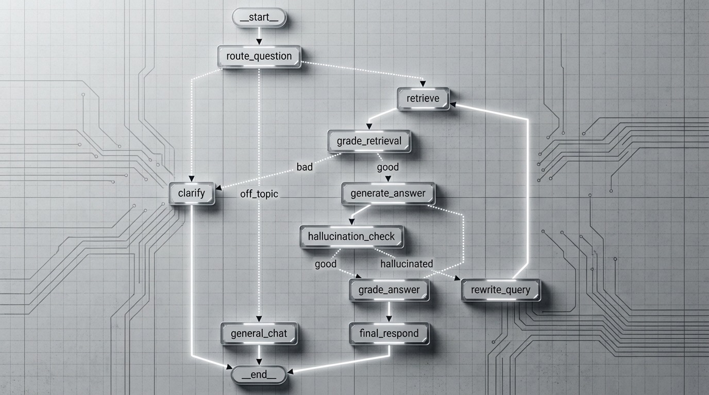

<div align="center">
  
[](README.md)
[](README.de.md)
[](README.ru.md)
[](README.zh.md)

</div>


### 👨‍💼 1. Агентный RAG-ассистент
[](assets/project_1.gif) [](https://huggingface.co/spaces/fcyber/agentic_rag)

#### Умный вопросно-ответный ассистент с интеллектуальной маршрутизацией, уточнением запросов, проверкой галлюцинаций и циклами самокоррекции.

<div align="center">


</div>

| Функция | Описание |
| :--- | :--- |
| **🔀 Интеллектуальная маршрутизация** | Динамически направляет запросы специализированным агентам на основе анализа намерений. |
| **🔍 Уточнение запросов** | Самостоятельно улучшает запросы через рефлексию и переписывание. |
| **✅ Проверка галлюцинаций** | Проверяет ответы на соответствие исходным документам с оценкой точности. |
| **🔄 Самокоррекция** | Автоматически обнаруживает и исправляет неадекватные ответы. |
| **📊 Гибридный поиск** | Объединяет семантический поиск, поиск по ключевым словам и поиск по графу знаний. |

---

<div align="center">



</div>

---


## 🚀 Начало работы

### 🎯 Сравнение быстрого старта (Обновлено)

| Метод | Команда | Время | Требует |
|--------|---------|------|----------|
| **Python** | `pip install -r requirements.txt && python app.py` | 2-5 min | Python 3.9+ |
| **Docker** | `docker-compose up -d` | 30 sec | Docker + Compose |
| **Hugging Face** | [](https://huggingface.co/spaces/fcyber/agentic_rag) | 1 sec | Web browser |
| **Production** | [-FC6D26?style=flat-square&logo=gitlab)](http://141.144.205.187:5000) | Instant | Web browser |

### 📦 Вариант 1: Python (Локальная настройка)


1. **Клонировать репозиторий**

```bash
git clone [https://github.com/fcyber/ai-engineering-hub.git](https://github.com/fcyber/ai-engineering-hub.git)
```

2. **Перейти в нужную директорию проекта**

```bash
cd ai-engineering-hub/01-agentic-rag-assistant
```

3. **Установить необходимые зависимости**

```bash
pip install -r requirements.txt && python app.py
```

#### Следуйте инструкциям в файле `README.md` каждого проекта для настройки и запуска приложения.

• • •

### 🐳 Вариант 2: Docker Compose (Рекомендуется)
[](https://hub.docker.com/r/fcyber/agentic-rag-assistant)
[](https://docs.docker.com/compose/)

1. **Клонировать репозиторий**

```bash
git clone https://github.com/fcyber/ai-engineering-hub.git
```

2. **Перейти в нужную директорию проекта**

```bash
cd ai-engineering-hub/01-agentic-rag-assistant
```

3. **Настроить переменные окружения**

```bash
cp .env.example .env
# Отредактируйте .env с вашими GROQ_API_KEY-ключами
```

4. **Запустить с Docker Compose**

```bash
docker-compose up -d
```

5. **Просмотр логов (опционально)**

```bash
docker-compose logs -f
```

6. **Откройте в браузере**

```bash
http://localhost:7860
```

7. **Остановить контейнер**

```bash
docker-compose down
```

**Вот и всё!** Проект включает предварительно настроенные `Dockerfile` и `docker-compose.yml` — дополнительная настройка не требуется.

• • •

### 🤗 Вариант 3: Hugging Face Spaces

[](https://huggingface.co/spaces/fcyber/)

```bash
# Установка не требуется! Нажмите на значок выше, чтобы попробовать живую демо.
# Или клонируйте и запустите локально:
pip install huggingface-hub
huggingface-cli download fcyber/agentic-rag-assistant
python app.py  # Gradio-приложения запускаются с python
```
